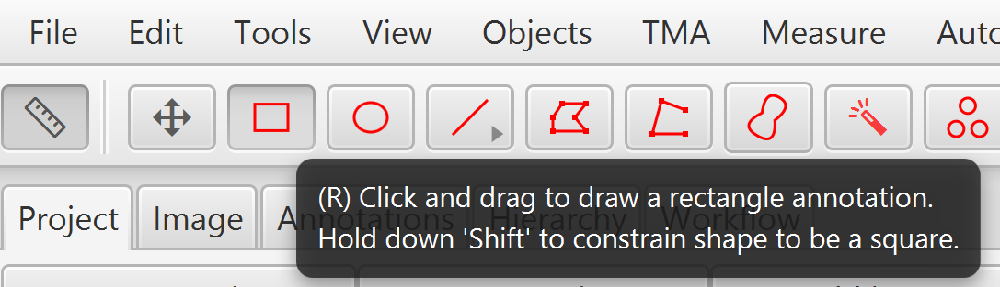
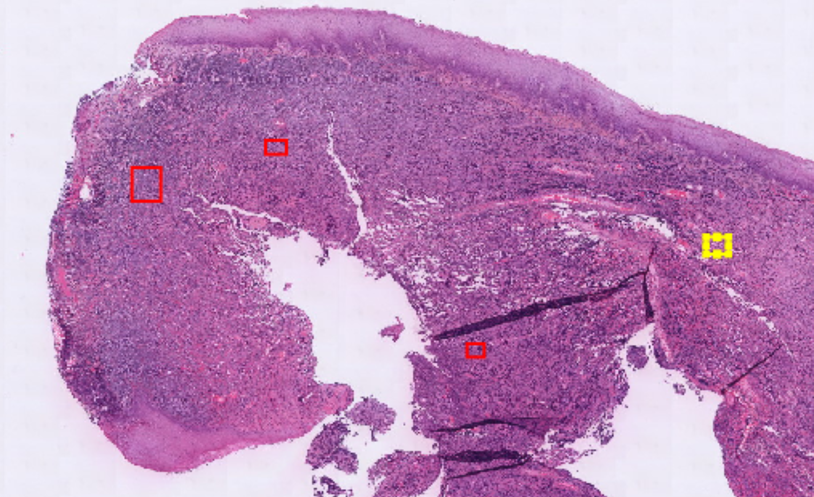
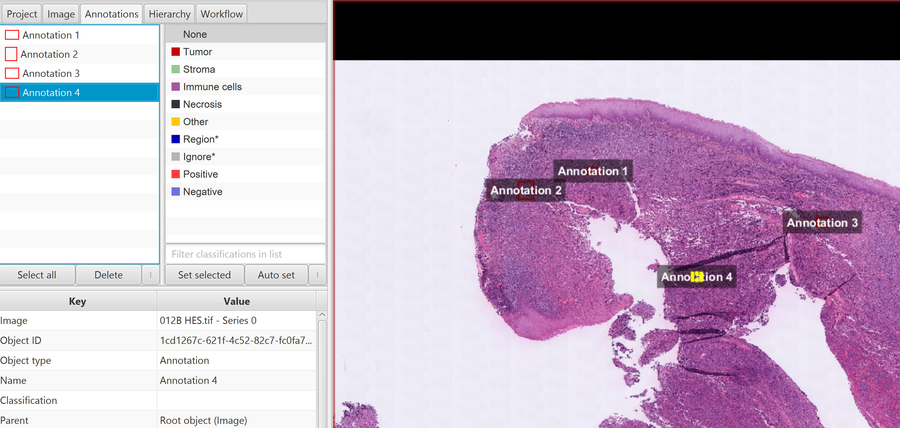

# QuPathLymphome
An Addon for QuPath to analyse Lymphome with AI

## Requirement and installation : 
### 0- QuPath
You can find QuPath 0.5.1 here for [windows](https://github.com/qupath/qupath/releases/download/v0.5.1/QuPath-v0.5.1-Windows.msi) or [Mac (M1/M2)](https://github.com/qupath/qupath/releases/download/v0.5.1/QuPath-v0.5.1-Mac-x64.pkg) and for other information or architecture you can go [here](https://qupath.github.io/).  
*Sometimes antivirus can be mad, click on "more info" then execute. Or launch the installer in administrator mode*


### 1- Python  
You need to have python 3 installed, you will find it there : [macOS 64-bit universal](https://www.python.org/ftp/python/3.11.3/python-3.11.3-macos11.pkg) or 
[Windows installer (64-bit)](https://www.python.org/ftp/python/3.11.3/python-3.11.3-amd64.exe).  
For more in foration you can go on the [python 3.11 page](https://www.python.org/downloads/release/python-3113/). *Don't forget to activate the environment PATH !*


### 2- Environment
Now that python is install you need to prepare the work environment. To do this you need to execute the script **setup_windows** for Windows or **setup_linuxMac** for others OS.


## Use
- Launch Qupath
- Import your image (you can also create a project or import a project with an image)
- Create an annotation   
  


- Rename annotations (an annotation name can't be duplicated) :Annotations > Right click > Ser properties > Name  


- Then select all your annotations
- Got to Automate > Script editor
- Import the grouvy file
- Run
- Select your working file (It's by default the project folder named QuPathLymphome)

## Project
Base project :
```
QuPathLymphome/
│
├── .git/                   # Git repository
├── groovyFile/             
│   └── script.groovy       # Groovy file to launch python project
├── blendmaps2/
│   ├── assets              # Style
│   ├── generateDatas.py    # File for testing purpose (generate random datas)
│   └── script.py           # Our algorithm and the main part of the project
├── pythonEnv/              # Virtual environment directory (ignored by git)                 [installation]  
│   ├── Scripts/            # python + control env
│   └── ...
├── requirements.txt        # Dependencies
├── .gitignore              # Git ignore file
├── setup_windows.bat       # Install Windows python environment and requirements
├── setup_windows.bat       # Install Mac andLinux python environment and requirements
└── LICENSE
```